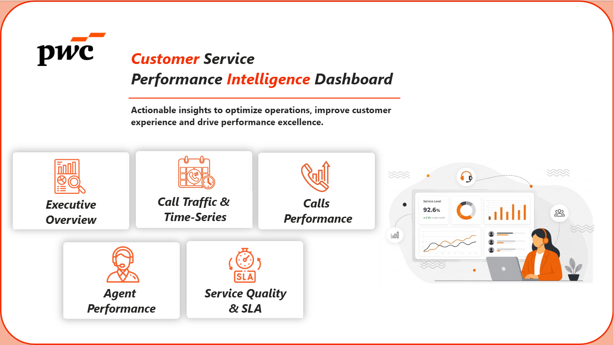

# 📞 Customer Service Performance Intelligence Dashboard

## 📌 Project Overview

This project analyzes customer service operations using the PwC Call Center Dataset. The dashboard was developed in Power BI to transform raw call center data into actionable insights that support operational efficiency, customer satisfaction, agent productivity, and service quality improvement.

The solution provides a comprehensive view of call center performance through five interactive dashboard pages covering executive KPIs, call traffic trends, operational performance, agent productivity, and SLA compliance.

---

## 🎯 Business Objectives

- Monitor overall call center performance.
- Analyze call volume trends and customer demand patterns.
- Measure call answering and resolution effectiveness.
- Evaluate agent productivity and customer satisfaction.
- Track SLA compliance and service quality metrics.
- Generate actionable business recommendations.

---

## 📊 Dashboard Landing Page

The dashboard is organized into five analytical sections that provide a complete view of customer service operations:

- Executive Overview
- Call Traffic & Time-Series
- Calls Performance
- Agent Performance
- Service Quality & SLA

---

# 📊 Dashboard Pages

## 1️⃣ Executive Overview

### Purpose
Provides a high-level summary of overall call center performance and key business KPIs.

### Key Insights
- 5,000 total calls were received during the analysis period.
- The answer rate reached 81.1%, while the resolution rate reached 72.9%.
- Customer Satisfaction (CSAT) averaged 3.40.
- Streaming and Technical Support generated the highest call volumes.

### Recommendations
- Improve customer satisfaction through faster issue resolution.
- Reduce unanswered calls through better workforce planning.
- Focus on high-volume support categories to reduce recurring issues.

---

## 2️⃣ Call Traffic & Time-Series

### Purpose
Analyzes customer demand patterns across days and hours to support workforce planning.

### Key Insights
- Peak traffic occurred at 1 PM, accounting for approximately 12% of total calls.
- Weekdays represented more than 70% of total call volume.
- Monday was the busiest day of the week.
- Call volume gradually decreased toward the end of the month.

### Recommendations
- Increase staffing during peak traffic hours.
- Allocate additional resources on Mondays.
- Use demand forecasting to improve workforce scheduling.

---

## 3️⃣ Calls Performance

### Purpose
Evaluates call handling effectiveness and resolution performance.

### Key Insights
- 4,054 calls were answered and 3,646 were resolved.
- Streaming and Technical Support were the most common inquiry categories.
- Technical Support recorded the highest number of unanswered calls.
- Most calls were medium-duration interactions.

### Recommendations
- Improve Technical Support workflows.
- Optimize call routing and escalation processes.
- Focus on increasing first-call resolution rates.

---

## 4️⃣ Agent Performance

### Purpose
Measures productivity, efficiency, and customer satisfaction across agents.

### Key Insights
- Workload distribution was relatively balanced across 8 agents.
- Jim handled the highest number of calls and achieved the strongest productivity.
- Martha achieved the highest customer satisfaction score.
- Diane recorded the lowest Average Handle Time (AHT).

### Recommendations
- Share best practices from top-performing agents.
- Provide targeted coaching and training where needed.
- Continue monitoring workload balance and efficiency.

---

## 5️⃣ Service Quality & SLA

### Purpose
Tracks SLA compliance, response times, and service quality performance.

### Key Insights
- Only 9.2% of answered calls met SLA requirements.
- More than 90% of calls exceeded SLA thresholds.
- SLA compliance declined slightly over the analyzed period.
- Slow response times were the primary contributor to SLA breaches.

### Recommendations
- Reduce Average Speed of Answer (ASA).
- Improve queue and response-time management.
- Establish SLA improvement targets and monitor progress regularly.

---

# 📈 Overall Business Recommendations

- Optimize staffing during peak hours and high-demand days.
- Improve Technical Support processes to reduce unanswered calls.
- Expand self-service channels such as FAQs and chatbots.
- Improve first-call resolution rates.
- Reduce response times to enhance SLA compliance.
- Leverage best practices from top-performing agents.
- Continuously monitor customer satisfaction and operational KPIs.

---

# 🛠 Tools & Technologies

- Microsoft Power BI
- Power Query Editor
- DAX (Data Analysis Expressions)
- CSV Dataset
- Figma
